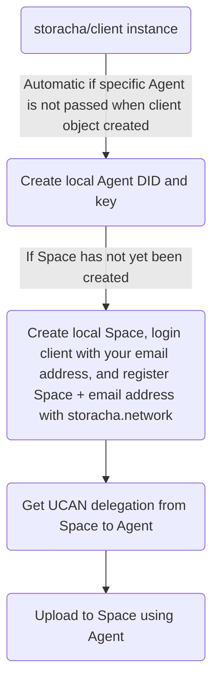
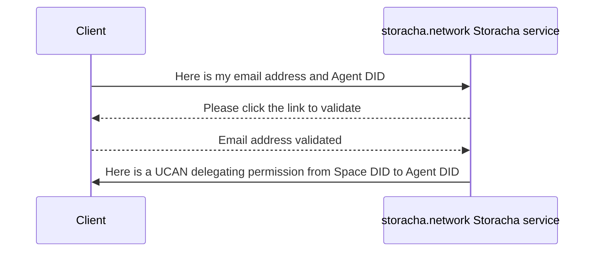
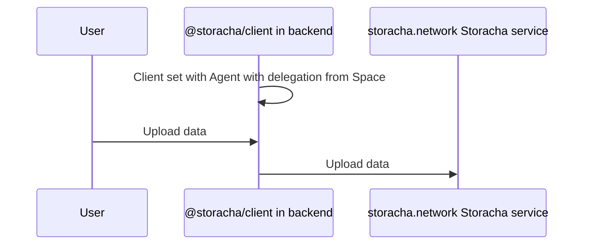
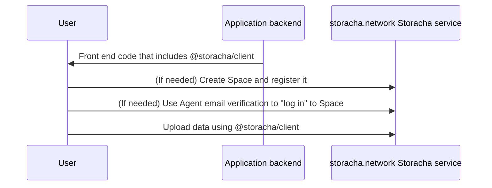

# About

- [How Storacha and `@storacha/client` use UCANs](#how-storacha-and-storachaclient-use-ucans)
  - [Space](#space)
  - [Agent](#agent)
- [Basic usage with storacha.network](#basic-usage-with-storachanetwork)
  - [Creating a client object](#creating-a-client-object)
  - [Creating and registering Spaces](#creating-and-registering-spaces)
  - [Delegating from Space to Agent](#delegating-from-space-to-agent)
    - [Bringing your own Agent and delegation](#bringing-your-own-agent-and-delegation)
  - [Uploading data](#uploading-data)
- [Integration options](#integration-options)
  - [Client-server](#client-server)
  - [Delegated](#delegated)
  - [User owned](#user-owned)

---

### How Storacha and `@storacha/client` use UCANs

`@storacha/client` and `ucanto` take care of the details of UCANs for you, but a few of the underlying terms and concepts may "bubble up" to the surface of the API, so we'll cover the basics here. We'll also go over some terms that are specific to Storacha that you might not have encountered elsewhere.

UCAN-based APIs are centered around _capabilities_, which are comprised of an _ability_ and a _resource_. Together, the ability and resource determine what action a client can perform and what objects in the system can be acted upon. When invoking a service method, a client will present a UCAN token that includes an ability and resource, along with _proofs_ that verify that they should be allowed to exercise the capability. The proof might be signed directly by the capability owner, or have a chain of signatures (_delegations_) where the actor invoking the capability has been verifiably delegated permission to do so.

#### Space

When you upload data to Storacha, your uploads are linked to a unique _Space_ that acts as a "namespace" for the data you upload. Each Space corresponds to a _DID_, or [Decentralized Identity Document](https://www.w3.org/TR/did-core/). In storacha.network's implementation of Storacha, these Space DIDs generally use the key DID method, of the form `did:key:publicKey` with a corresponding private signing key.

When creating a Space using `@storacha/client`, it generates this private key and `did:key` for you locally. To use storacha.network, you then register a Space by associating it with your email address. From there, when invoking storage capabilities with storacha.network, the Space `did:key` is the "resource" portion of the capability, while the ability is an action like `blob/add` or `blob/remove`. (A Space registered with storacha.network is imperfectly analogous to an "account" with storacha.network.)

Under the hood in the email registration process, your Space delegates the capabilities needed to use Storacha to your email address, and this delegation is stored by storacha.network. If you need access to your Space in the future from any device, storacha.network allows you to reclaim those capabilities the same way you would reset a password in other services - using an email verification process. This means you don't need to store or manage Space private keys to use Storacha - just create a new space, register it with Storacha and use it from as many devices as you like. More on this "sign in" process is detailed in the next section on Agents.

#### Agent

To invoke a capability like `blob/add` on a Space using `@storacha/client`, the client must have an _Agent_. Like a Space, an Agent corresponds to a `did:key` whose private key is generated locally. An Agent is useful once `@storacha/client` has a UCAN delegation where a registered Space(s) delegates the Agent its capabilities. (An imperfect analogy is Agent with login session.)

The first time `@storacha/client` is instantiated on a device, it creates an Agent automatically. Alternatively, if you have your own Agent corresponding to a specific private key locally available, you can pass it to the client.

The delegation from a Space to your Agent that `@storacha/client` needs can be passed either by verifying the email address the Space is registered to and claiming the UCAN delegation (`login(email)` then `capability.access.claim`) or directly if you have the UCAN delegation available locally (`addSpace(delegation)`).

### Basic usage with storacha.network



All uses of `@storacha/client` to upload with storacha.network follow the flow above. This section shows the most basic way to use the client to start storing data. For more complex integration options, check out the [integration options](https://github.com/storacha/upload-service/blob/main/packages/@storacha/client/README.md#integration-options) docs. For reference, check out the [API reference docs][docs] or the source code of the [CLI package][cli-github], which uses `@storacha/client` throughout.

> By you or your users registering a Storacha Space via email confirmation with [storacha.network](https://storacha.network), you agree to the [Terms of Service](https://docs.storacha.network/terms/).

#### Creating a client object

The package provides a [static `create` function][docs-create] that returns a `Client` object.

```js
import { create } from '@storacha/client'

const client = await create()
```

By default, clients will create a new [`Agent`](#agent) and put it in a persistent local [`Store`](https://github.com/storacha/upload-service/tree/main/packages/access-client) if it can't find an existing one to load (so the next time the client is initialized on the same device, it will use the same `Agent`).

`create` accepts an optional [`ClientFactoryOptions` object][docs-ClientFactoryOptions] that can be used configured to use a non-default persistent `Store`. See the [`@storacha/access` docs](https://github.com/storacha/upload-service/tree/main/packages/access-client) for more about `Store` configuration. If you'd like to bring your own Agent, you can initialize the client with your own storage [Driver](https://github.com/storacha/upload-service/blob/main/packages/@storacha/client/README.md#driver).

```js
import { create } from '@storacha/client'
import * as Signer from '@storacha/client/principal/ed25519'

const principal = Signer.parse(agentPrivateKey) // created by `npx ucan-key ed --json` in command line
const client = await create({ principal })
```

Once initialized, you can access the client's `Agent` with the [`agent` getter][docs-Client#agent].

##### Pre-built bundle

You can also import a pre-built bundle, which adds the exports from the client to a _global_ variable `StorachaClient`:

```html
<!DOCTYPE html>
<script src="https://cdn.jsdelivr.net/npm/@storacha/client/browser.min.js"></script>
<script>
  async function main() {
    const client = await StorachaClient.create()
    console.log(client.did())
  }
  main()
</script>
```

#### Creating and registering Spaces

A [`Space`](#space) acts as a namespace for your uploads, and what your Agent will need a delegation from to store data with Storacha. The first thing to do is login your Agent with your email address. Calling `login` will cause an email to be sent to the given address. Once a user clicks the confirmation link in the email, the `login` method will resolve. Make sure to check for errors, as `login` will fail if the email is not confirmed within the expiration timeout. Authorization needs to happen only once per agent.

```js
const account = await client.login('zaphod@beeblebrox.galaxy')
```

If your account doesn't have a payment plan yet, you'll be prompted to select one after verifying your email. A payment plan is required to provision a space. You can use the following loop to wait until a payment plan is selected:

```js
// Wait for a payment plan with a 1-second polling interval and 15-minute timeout
await account.plan.wait()
```

Spaces can be created using the [`createSpace` client method][docs-client#createSpace]:

```js
const space = await client.createSpace('my-awesome-space', { account })
```

Alternatively, you can use the CLI command [`storacha space create`](https://github.com/storacha/upload-service/tree/main/packages/cli#storacha-space-create-name).

The `name` parameter is optional. If provided, it will be stored in your client's local state store and can be used to provide a friendly name for user interfaces.

If an `account` is provided in the options, a delegated recovery account is automatically created and provisioned, allowing you to store data and delegate access to the recovery account. This means you can access your space from other devices, as long as you have access to your account.

If this is your Agent's first space, it will automatically be set as the "current space." If you already have spaces and want to set the new one as current, you can do so manually:

```js
await client.setCurrentSpace(space.did())
```

ℹ️ Note: If you do not create the space passing the account parameter you run the risk of losing access to your space!

#### Delegating from Space to Agent

In order to store data with Storacha, your Agent will need a delegation from a Space. This automatically happens if you called `createSpace`. However, if you are initializing the client with a previously created Space, you can `login(email)` then claim a delegation granted to the account associated with your email:

```js
await client.login('zaphod@beeblebrox.galaxy')
await client.setCurrentSpace(space.did()) # select the relevant Space DID that is associated with your account
```



##### Bringing your own Agent and delegation

For uses of `@storacha/client` in environments where the Agent is not persisted and/or the email verification step would be prohibitive (e.g., serverless backend environment where local Store with the Agent is dropped in between runs, and going through the email verification flow isn't practical), you can manually add a delegation for access to a Space created by a different authorized agent (see the [`addSpace` client method](docs-client#addSpace)). An example (where [`storacha`](https://github.com/storacha/upload-service/tree/main/packages/cli) is set up with the Space that we want to delegate permissions from in our client instance):

```js
import * as Client from '@storacha/client'
import * as Signer from '@storacha/client/ed25519'
import { StoreMemory } from '@storacha/client/stores/memory'
import * as Proof from '@storacha/client/proof'

async function main() {
  // from "bring your own Agent" example in `Creating a client object" section`
  // used command line to generate KEY and PROOF (stored in env variables)
  // KEY: `npx ucan-key ed --json` in command line, which returns private key and DID for Agent (the private key is stored in KEY)
  // PROOF: CLI used to run `storacha delegation create <did_from_ucan-key_command_above> --can 'blob/add' --can 'index/add' --can 'filecoin/offer' --can 'upload/add' | base64`, which returns the delegation from Space to the Agent we're using (stored in PROOF)
  const principal = Signer.parse(process.env.KEY)
  const store = new StoreMemory()
  const client = await Client.create({ principal, store })

  // now give Agent the delegation from the Space
  const proof = await Proof.parse(process.env.PROOF)
  const space = await client.addSpace(proof)
  await client.setCurrentSpace(space.did())

  // READY to go!
}
```

#### Uploading data

Once you've [created and registered a Space](#creating-and-registering-spaces) and [authorized your Agent](#authorize), you can upload files to the Storacha platform.

Call [`uploadFile`][docs-Client#uploadFile] to upload a single file, or [`uploadDirectory`][docs-Client#uploadDirectory] to upload multiple files.

`uploadFile` expects a "Blob like" input, which can be a [`Blob`](https://developer.mozilla.org/en-US/docs/Web/API/Blob) or [`File`](https://developer.mozilla.org/en-US/docs/Web/API/File) when running in a browser. On node.js, see the [`filesFromPath` library](https://github.com/storacha/files-from-path), which can load compatible objects from the local filesystem.

`uploadDirectory` requires `File`-like objects instead of `Blob`s, as the file's `name` property is used to build the directory hierarchy.

You can control the directory layout and create nested directory structures by using `/` delimited paths in your filenames:

```js
const files = [
  new File(['some-file-content'], 'readme.md'),
  new File(['import foo'], 'src/main.py'),
  new File([someBinaryData], 'images/example.png'),
]

const directoryCid = await client.uploadDirectory(files)
```

In the example above, `directoryCid` resolves to an IPFS directory with the following layout:

```text
.
├── images
│   └── example.png
├── readme.md
└── src
    └── main.py
```

### Integration options

As mentioned, UCAN opens up a number of options in how to integrate with Storacha: Should you, the developer, own the Space? Should you delegate permissions to your users? Or should your user own their own Space? Broadly, there are three ways to integrate:

- (Simplest) Client-server: You (the developer) own the Space, and your user uploads to your backend infra before you upload it to the service
- (More complex) Delegated: You own the Space, but you give a delegated UCAN token to your user's Agent to upload directly to the service (rather than needing to touch the upload in your backend)
- (Most complex) User-owned: Your user owns the Space and registers it and they use it to upload directly with the service; if you want to instrument visibility into what they’re uploading, you’ll have to write separate code in your app for it

You can implement each of these in a number of ways, but we talk through some considerations when implementing a given option.

#### Client-server



- For your backend to be scalable, you might consider using serverless workers or a queue in front of a server
- In either case, you'll need a registered Space, and your client instance in your backend to have an Agent with a delegation from this Space
  - (Recommended) It's likely easiest to create and register your Space using the [CLI](https://github.com/storacha/upload-service/tree/main/packages/cli) rather than using `@storacha/client` to do so (especially if your backend isn't persistent); you can then generate your own Agent and delegate the ability to upload to your Space using something like [this example](#bringing-your-own-agent-and-delegation)
  - If your backend is persistent, you can do this or do everything in the client directly ([create Space](#creating-and-registering-spaces) and [get delegation](#delegating-from-space-to-agent))
- After this, once your user uploads data to your backend, you can run any of the `upload` methods

#### Delegated

```mermaid
sequenceDiagram
    participant @storacha/client in user
    participant @storacha/client in backend
    participant storacha.network Storacha service
    @storacha/client in backend->>@storacha/client in backend: Client created with Agent and delegation from Space
    @storacha/client in user->>@storacha/client in user: Client instantiated with default Agent
    @storacha/client in user->>@storacha/client in backend: Request delegation with user's Agent DID
    @storacha/client in backend->>@storacha/client in user: Send delegation from Space to user's Agent DID
    @storacha/client in user->>storacha.network Storacha service: Upload data
```

- You will likely have `@storacha/client` running in your end-user's client code, as well as backend code that's able to generate UCANs that delegate the ability to upload and pass them to your users (e.g., `@storacha/client` running in a serverless worker)
- For your backend to be scalable, you might consider using serverless workers or a queue in front of a server
- As the developer, you'll need a registered Space, and your client instance in your backend to have an Agent with a delegation from this Space
  - (Recommended) It's likely easiest to create and register your Space using the [CLI](https://github.com/storacha/upload-service/tree/main/packages/cli) rather than using `@storacha/client` to do so (especially if your backend isn't persistent); you can then generate your own Agent and delegate the ability to upload to your Space using something like [this example](#bringing-your-own-agent-and-delegation)
  - If your backend is persistent, you can do this or do everything in the client directly ([create Space](#creating-and-registering-spaces) and [get delegation](#delegating-from-space-to-agent))
- Your user does not need a registered Space - just an Agent with a delegation from your Space
  - `@storacha/client` in the end user environment should have a unique Agent for each user, which should happen by default (since when `@storacha/client` is instantiated it creates a new Agent anyway, or uses the one in local Store)
  - From there, when your end user is ready to upload, they should request from your backend a delegation from your developer-owned Space to their Agent (which can be derived via [`client.agent`](docs-Client#agent))
    - In your backend, you can call [`client.createDelegation()`](docs-Client#createDelegation) passing in the Agent object from `client.agent()` in your end user's instance, and passing through `options?` params to limit the scope of the delegation (e.g., `blob/add`, `upload/add`, expiration time)
    - You can serialize this using `delegation.archive()` and send it to your user
    - The end user instance of the client should not need to call `client.login(email)`, as it is not claiming any delegations via email address (but rather getting the delegation directly from your backend)
- Once your user receives the delegation, they can deserialize it using [`ucanto.Delegation.extract()`](https://github.com/storacha/ucanto/blob/c8999a59852b61549d163532a83bac62290b629d/packages/core/src/delegation.js#L399) and pass it in using `client.addSpace()`, and from there they can run any of the `upload` methods
  - Note that this alone does not give visibility into which of your end users are uploading what; to track this, you'll probably need them to send you that information separately (e.g., once they've run `upload` and get back a content CID, you can have them send that CID to you for tracking)
- A code example that does this can be found below

```js
import * as DID from '@ipld/dag-ucan/did'
import * as Client from '@storacha/client'
import * as Signer from '@storacha/client/principal/ed25519'
import * as Proof from '@storacha/client/proof'

// Handler for `/api/storacha-delegation/{did}`
async function backend(did: string) {
  // Load client with specific private key
  const principal = Signer.parse(process.env.KEY)
  const client = await Client.create({ principal })

  // Add proof that this agent has been delegated capabilities on the space
  const proof = await Proof.parse(process.env.PROOF)
  const space = await client.addSpace(proof)
  await client.setCurrentSpace(space.did())

  // Create a delegation for a specific DID
  const audience = DID.parse(did)
  const abilities = ['blob/add', 'index/add', 'filecoin/offer', 'upload/add']
  const expiration = Math.floor(Date.now() / 1000) + 60 * 60 * 24 // 24 hours from now
  const delegation = await client.createDelegation(audience, abilities, {
    expiration,
  })

  // Serialize the delegation and send it to the client
  const archive = await delegation.archive()
  return archive.ok
}

async function frontend() {
  // Create a new client
  const client = await Client.create()

  // Fetch the delegation from the backend
  const apiUrl = `/api/storacha-delegation/${client.agent().did()}`
  const response = await fetch(apiUrl)
  const data = await response.arrayBuffer()

  // Deserialize the delegation
  const delegation = await Delegation.extract(new Uint8Array(data))
  if (!delegation.ok) {
    throw new Error('Failed to extract delegation')
  }

  // Add proof that this agent has been delegated capabilities on the space
  const space = await client.addSpace(delegation.ok)
  client.setCurrentSpace(space.did())

  // READY to go!
}
```

#### User-owned



- If you want your user to own their own Space, you'll likely be relying on the `@storacha/client` methods to create a Space, authorize the Space, and authorize the Agent on the end user-side; from there they can run any of the `upload` methods
  - Doing this does take some of the UX out of your control; for instance, when storacha.network fully launches with Storacha, your users will have to set up their payment methods with storacha.network
  - Note that this alone does not give visibility into which of your end users are uploading what; to track this, you'll probably need them to send you that information separately (e.g., once they've run `upload` and get back a content CID, you can have them send that CID to you for tracking)
- There is a world of possibilities with your users "bringing their own identity" for their Space; you could explore how crypto wallet private keys, Apple Passkey, and more might map to Space DIDs and have the client use those
- If you have code snippet(s) that works for you, please share them in a PR or [Github issue](https://github.com/storacha/upload-service/issues) and we'll link them here!


[cli-github]: https://github.com/storacha/upload-service/tree/main/packages/cli
[docs]: https://github.com/storacha/upload-service/tree/main/packages/w3up-client#api
[docs-create]: https://github.com/storacha/upload-service/tree/main/packages/w3up-client#create
[docs-Client#agent]: https://github.com/storacha/upload-service/tree/main/packages/w3up-client#agent
[docs-Client#createDelegation]: https://github.com/storacha/upload-service/tree/main/packages/w3up-client#createdelegation
[docs-Client#createSpace]: https://github.com/storacha/upload-service/tree/main/packages/w3up-client#createspace
[docs-Client#setCurrentSpace]: https://github.com/storacha/upload-service/tree/main/packages/w3up-client#setcurrentspace
[docs-Client#uploadFile]: https://github.com/storacha/upload-service/tree/main/packages/w3up-client#uploadfile
[docs-Client#uploadDirectory]: https://github.com/storacha/upload-service/tree/main/packages/w3up-client#uploaddirectory
[docs-ClientFactoryOptions]: https://github.com/storacha/upload-service/tree/main/packages/w3up-client#clientfactoryoptions
